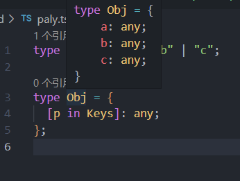

 
### 一、TypeScript 类
一个类可以包含以下几个模块：
* 1.属性
   * 1.1 类属性  
   * 1.2 实例属性
* 2.构造函数（在python中叫初始化函数)
该函数在类实例化时会被立即调用
* 3.方法（也是函数，不过不用写 关键字function的函数） 

#### 1.1 类的属性与方法
官网:
传统的JavaScript程序使用函数和基于原型的继承来创建可重用的组件，但对于熟悉使用面向对象方式的程序员来讲就有些棘手，因为他们用的是基于类的继承并且对象是由类构建出来的。 ES6 开始JavaScript程序员将能够使用基于类的面向对象的方式。 使用TypeScript，我们允许开发者现在就使用这些特性，并且编译后的JavaScript可以在所有主流浏览器和平台上运行，而不需要等到下个JavaScript版本。


在 TypeScript 中，我们可以通过 `Class` 关键字来定义一个类：

```typescript
class Greeter {
  static cname: string = "Greeter";
  greeting: string;
  constructor(message: string) {
    this.greeting = message;
  }
  static getClassName() {
    return "Class name is Greeter";
  }
  greet() {
    return "Hello, " + this.greeting;
  }
}
let greeter = new Greeter("world");
```

那么成员属性与静态属性，成员方法与静态方法有什么区别呢？这里无需过多解释，我们直接看一下编译生成的 ES5 代码：

```typescript
"use strict";
var Greeter =  (function () {
    function Greeter(message) {
      this.greeting = message;
    }
    
    Greeter.getClassName = function () {
      return "Class name is Greeter";
    };
    
    Greeter.prototype.greet = function () {
      return "Hello, " + this.greeting;
    };
    
    Greeter.cname = "Greeter";
    return Greeter;
}());
var greeter = new Greeter("world");
```

####  1.2  私有字段

在 TypeScript 3.8 版本就开始支持 **ECMAScript 私有字段**，使用方式如下：

```typescript
class Person {
  #name: string;

  constructor(name: string) {
    this.#name = name;
  }

  greet() {
    console.log(`Hello, my name is ${this.#name}!`);
  }
}

let semlinker = new Person("Semlinker");

semlinker.#name;
```

与常规属性（甚至使用 `private` 修饰符声明的属性）不同，私有字段要牢记以下规则：

*   私有字段以 `#` 字符开头，有时我们称之为私有名称；
*   每个私有字段名称都唯一地限定于其包含的类；
*   不能在私有字段上使用 TypeScript 可访问性修饰符（如 public 或 private）；
*   私有字段不能在包含的类之外访问，甚至不能被检测到。

#### 1.3 get 和 set 关键字
面向对象的封装性要求中，常需要我们对类的一些属性进行封装，避免外部直接操作属性，经常使用两个方法进行处理，Getter 方法用于获取属性的值，Setter 方法用户设置属性的值。在 Ts 中可以使用 get 和 set 关键字来定义这两个方法
```typescript
class Student{
	private _name;
	constructor(name: string){
		this._name = name;
	}
	get name(){
		return this._name;
	}
	set name(name: string){
		this._name = name;
	}
}

// 此时实例对象我们可以这样对name属性进行处理
let obj = new Student("chen")
obj.name = "zhang"
```

####  1.4 类的继承

继承（Inheritance）是一种联结类与类的层次模型。指的是一个类（称为子类、子接口）继承另外的一个类（称为父类、父接口）的功能，并可以增加它自己的新功能的能力，继承是类与类或者接口与接口之间最常见的关系。
 

在 TypeScript 中，我们可以通过 `extends` 关键字来实现继承：

```typescript
class Animal {
  name: string;
  
  constructor(theName: string) {
    this.name = theName;
  }
  
  move(Meters: number = 0) {
    console.log(`${this.name} moved ${Meters}m.`);
  }
}
class dog extends Animal {
  constructor(name: string) {
    super(name); 
  }
  
  move(Meters = 5) { 
    super.move(Meters);
  }
}

let sam = new dog("dog");
sam.move();
```

####  1.5 抽象类

使用 `abstract` 关键字声明的类，我们称之为抽象类。抽象类不能被实例化，因为它里面包含一个或多个抽象方法。所谓的抽象方法，是指不包含具体实现的方法：

```typescript
abstract class Person {
  constructor(public name: string){}

  abstract say(words: string) :void;
}


const lolo = new Person(); //无法创建抽象类的实例
```

抽象类不能被直接实例化，我们只能实例化实现了所有抽象方法的子类。简单理解可以将它理解为一个模板类，其中可以定义一些未实现的方法，然后通过继承让其子类来实现这个 方法。具体如下所示：

```typescript
abstract class Person {
  constructor(public name: string) {}

  abstract say(words: string): void;
}

class Developer extends Person {
  constructor(name: string) {
    super(name);
  }

  say(words: string): void {
    console.log(`${this.name} says ${words}`);
  }
}
```

#### 1.6 类方法重载

在前面的章节，我们已经介绍了函数重载。对于类的方法来说，它也支持重载。比如，在以下示例中我们重载了 `ProductService` 类的 `getProducts` 成员方法：

```typescript
class ProductService {
    getProducts(): void;
    getProducts(id: number): void;
    getProducts(id?: number) {
      if(typeof id === 'number') {
          console.log(`获取id为 ${id} 的产品信息`);
      } else {
          console.log(`获取所有的产品信息`);
      }  
    }
}

const productService = new ProductService();
productService.getProducts(666); 
productService.getProducts();
```
#### 1.7 static
当类 中 的 方法 被 声明 为 static 时，其实例化 对象 不可 调用 该方法，只有 类 本身 ，以及 其子类 可以 调用。
```typescript
class A {
	name:string;
	age:number;
	constructor(name:string,age:number){
		this.name = name;
		this.age = age;
	}
	eat(){
		console.log('测试');
	}
	static eat2(){
		console.log('测试2');
	}
}
let a = new A('zhangsan',8);
a.eat();//   '测试'
a.eat2();// error 

class B extends A {
	constructor(name:string,age:number){
		super(name,age);
	}
}
let  b = new B('lisi',9);
b.eat();// '测试'
b.eat2();// error
B.eat2();// '测试2' 
```
###  二、TypeScript 泛型

软件工程中，我们不仅要创建一致的定义良好的 API，同时也要考虑可重用性。 组件不仅能够支持当前的数据类型，同时也能支持未来的数据类型，这在创建大型系统时为你提供了十分灵活的功能。  
泛型（Generics）是允许同一个函数接受不同类型参数的一种模板。相比于使用 any 类型，使用泛型来创建可复用的组件要更好，因为泛型会保留参数类型。

####  2.1 泛型语法

对于刚接触 TypeScript 泛型的读者来说，首次看到 `<T>` 语法会感到陌生。其实它没有什么特别，就像传递参数一样，我们传递了我们想要用于特定函数调用的类型。
 

参考上面的图片，当我们调用 `identity<Number>(1)` ，`Number` 类型就像参数 `1` 一样，它将在出现 `T` 的任何位置填充该类型。图中 `<T>` 内部的 `T` 被称为类型变量，它是我们希望传递给 identity 函数的类型占位符，同时它被分配给 `value` 参数用来代替它的类型：此时 `T` 充当的是类型，而不是特定的 Number 类型。

其中 `T` 代表 **Type**，在定义泛型时通常用作第一个类型变量名称。但实际上 `T` 可以用任何有效名称代替。除了 `T` 之外，以下是常见泛型变量代表的意思：

*   K（Key）：表示对象中的键类型；
*   V（Value）：表示对象中的值类型；
*   E（Element）：表示元素类型。

其实并不是只能定义一个类型变量，我们可以引入希望定义的任何数量的类型变量。比如我们引入一个新的类型变量 `U`，用于扩展我们定义的 `identity` 函数：

```typescript
function identity <T, U>(value: T, message: U) : T {
  console.log(message);
  return value;
}

console.log(identity<Number, string>(68, "Semlinker"));
``` 

除了为类型变量显式设定值之外，一种更常见的做法是使编译器自动选择这些类型，从而使代码更简洁。我们可以完全省略尖括号，比如：

```typescript
function identity <T, U>(value: T, message: U) : T {
  console.log(message);
  return value;
}

console.log(identity(68, "Semlinker"));
```
 在使用泛型的时候 类型推论显得尤为重要

####  2.2 泛型接口

```typescript
interface GenericIdentityFn<T> {
  (arg: T): T;
}
```

####  2.3 泛型类

```typescript
class GenericNumber<T> {
  zeroValue: T;
  add: (x: T, y: T) => T;
}

let myGenericNumber = new GenericNumber<number>();
myGenericNumber.zeroValue = 0;
myGenericNumber.add = function (x, y) {
  return x + y;
};
```

#### 2.4 泛型工具类型(很重要) 

#####  1.typeof

在 TypeScript 中，`typeof` 操作符可以用来获取一个变量声明或对象的类型。

```typescript
interface Person {
  name: string;
  age: number;
}

const sem: Person = { name: 'semlinker', age: 33 };
type Sem= typeof sem; 

function toArray(x: number): Array<number> {
  return [x];
}

type Func = typeof toArray;
```

#####  2.keyof

`keyof` 操作符是在 TypeScript 2.1 版本引入的，该操作符可以用于获取某种类型的所有键，其返回类型是联合类型。

```typescript 
type Point = { x: number; y: number };
type P = keyof Point;
// type P = "x" | "y"

type Arrayish = { [n: number]: unknown };
type A = keyof Arrayish;
// type A = number

type Mapish = { [k: string]: boolean };
type M = keyof Mapish;
// type M = string | number 
//注意 JavaScript 对象的属性名会被强制转为一个字符串
```
 
#####  3.in

`in` 用来遍历枚举类型： 注意不能用于interface

```
type Keys = "a" | "b" | "c"

type Obj =  {
  [p in Keys]: any
}
```


#####  4.infer

在条件类型语句中，可以用 `infer` 声明一个类型变量并且对它进行使用。

```typescript
type ListType<V> = V extends { list?: infer K } ? K : V

```

以上代码中 `infer R` 就是声明一个变量来承载传入函数签名的返回值类型，简单说就是用它取到函数返回值的类型方便之后使用。 上述简单来说K 接收 list的返回类型  如果V中有可选list  那么V的类型就是K 也就是list 否则V的类型是它本身

#####  5.extends

有时候我们定义的泛型不想过于灵活或者说想继承某些类等，可以通过 extends 关键字添加泛型约束。

```typescript
interface Lengthwise {
  length: number;
}

function loggingIdentity<T extends Lengthwise>(arg: T): T {
  console.log(arg.length);
  return arg;
}
```

现在这个泛型函数被定义了约束，因此它不再是适用于任意类型：

```
loggingIdentity(3);
```

这时我们需要传入符合约束类型的值，必须包含必须的属性：

```
loggingIdentity({length: 10, value: 3});
```

##### 6 Partial

`Partial<T>` 的作用就是将某个类型里的属性全部变为可选项 `?`。

**定义：**

```
type Partial<T> = {
  [P in keyof T]?: T[P];
};
```

在以上代码中，首先通过 `keyof T` 拿到 `T` 的所有属性名，然后使用 `in` 进行遍历，将值赋给 `P`，最后通过 `T[P]` 取得相应的属性值。中间的 `?` 号，用于将所有属性变为可选。

**示例：**

```typescript
interface Todo {
  key: string;
  value: string;
}
//使用Partial的情况就变成了
Partial<Todo> 
//相当于 
interface Todo {
  key?: string;
  value?: string;
}
 
```
 

##### 7 Readonly
用来构造一个类型，将Type的所有属性都设置为readonly（只读） 无法修改
```TYPESCRIPT
interface Props {
    id: string 
} 
type Type= Readonly<Props>
let a={
  id:1
}
a.id=3  //ERROR 
```

##### 8 Pick<Type, Keys>
 从Type中选择一组属性来构造新类型
 ```TYPESCRIPT
 interface Props {
    id: string
    title: string
    children: number[]
}

type PickProps = Pick<Props, 'id'|'title'>
 ```
> 1 Pick工具类型有两个类型变量：1、表示选择谁的属性 2、表示选择哪几个属性。
> 2 其中第二个类型变量，如果只选择一个则只传入该属性名即可。
> 3 第二个类型变量传入的属性只能是第一个类型变量中存在的属性。
> 4 构造出来的新类型PickProps，只有id和title两个属性类型。

##### 9  Record<Keys,Type>
构造一个对象类型，属性键为Keys，属性类型为Type。
```typescript
export default interface CurrentUser {
  /** 权限对象 */
  roles: Record<string, boolean>
}
// .roles 对象可以字符串为keys  但是值必须是boolean类型

```
