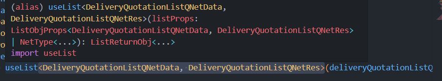

> 最近在写一些公用逻辑时，用到了TS一些细节上的东西，对于复杂的用法也尝试了一下。可能不是最佳实践!但是想记录下这一次真实业务场景下的实践。

之前对于ts的理解仅仅在于规范代码，提供各种类型，数据结构更加合理，以及类型推断，智能提示等。这段时间好好看了一些第三方库做的完美示范 如vue3类型源码,ant-d的组件.d.ts,结合自己的业务加深了对于ts的应用。

1. 对于一些陌生的组件,文件可以通过 `type`、`interface`  类型快速理解每段
2. 获取其他属性的时候有**快捷提示**。我们经常会调用一个对象中的某个属性或某个方法，在没有提示的情况下需要完整的敲出整个单词，使用 ts 后，1-2 个字母就可以帮我们快速定位到目标。此外我们可以结合 /** 自定义参数处理-调用列表接口前的参数并集 */ 这种的注释也会加入提示中
3. 在处理一些类型约束，重载的时候处理`if-else` 逻辑的函数，使用 ts 可以清晰地涵盖所有类型返回，帮助我们注意到需求针对某种场景下可能存在的 `undefined`、`null` 进行特殊处理。 
4. 泛型和推论的结合，可以节约很多定义类型声明 以及 传参声明。通过传入的参数 去进行类型推论 黑盒组件往往只需对应传参就可以进行一系列的推论。

### 利用好类型推断
TS写的越多发现类型推断越厉害,虽然有的时候会造成一些你没有预料的提示类型错误，或者一些类型定义的冲突 需要你手动解决 但是很多时候类型自动推断 意味着你不需要手动声明
比如根据参数的类型，推端出返回值的类型
```typescript
function add (x: number, y: number) {
  return x + y;
}

let sum = add (1, 2);   // 推断出sum的类型也是number 
sum = '123';    // Type '"123"' is not assignable to type 'number'.

// y 被推断为number | undefined
function add1 (x: number, y = 2) {
  return x + y;  
}
add1(1, '2');  // Argument of type '"2"' is not assignable to parameter of type 'number | undefined'.
 
```
关于泛型和推论的运用




### 利用好enum 不要去纠结value的值 
```typescript
//我这里是const enum
const enum ActivityStatus { //value
  Edit,
  Preonline,
  Online,
  Offline
} 
const statusMap: Readonly<Record<ActivityStatus, string>> = { 
    //laber
    [ActivityStatus.Edit]: '编辑中',
    [ActivityStatus.Preonline]: '待上线',
    [ActivityStatus.Online]: '上线',
    [ActivityStatus.Offline]: '下线',
};

const renderStatus = (item: ActivityStatus) => {
    const desc = statusMap[item] || ''; 
} 

//你觉得const enum 和enum哪个好
  enum ActivityStatus { //value
  Edit = '编辑',
  Preonline = '预上线',
  Online = '2',
  Offline = '3',
}
const renderStatus = (item: "Edit" | "Preonline" | "Online" | "Offline") => {
  const desc = ActivityStatus.Edit;
  const desc2 = ActivityStatus[item]; 
}; 

// 当然你可以这样 但是上述item:ActivityStatus 失去了类型保护 
const   ActivityStatus ={
  Edit:'编辑中',
  Preonline:'待上线',
  Online:'上线',
  Offline:'下线'
} 
const renderStatus = (item => {
    const desc = ActivityStatus[item] || ''; 
}  
//
```


### string的约束
在很多业务场景下，我们封装的某个方法往往不是对所有 `string` 类型的参数都生效的，这个时候我们最好的方法就是通过 type 来限制字符串的类型。
比如我刚刚的 item: "Edit" | "Preonline" | "Online" | "Offline"

有几个好处
1. **提示拼写** 
2. 限制string类型，也让别人明白此处的值   用的比较多的就是  'edit'|'detail'  比如模态框 的名称
3.  模板类型中也可以参与限制 

 

### 小技巧

1.  依赖第三方库    一般的第三方库都会将使用到的类型在入口文件一并导出，所以我们跳到源码看一下是否有需要的类型。 

2.  一些快速申明的方法 
```TYPESCRIPT
interface Student {
  name: string;
  age: number;
}

type Student2 = Pick<Student, 'name'>

type Student3 = Omit<Student, 'name'>

type Student4 = Student & { gender: 0 | 1 }

interface Student5 extends Student {
  gender: 0 | 1
}
由上到下分别是：

*   仅保留 name；
*   删除 name；
*   添加 gender；
*   添加 gender。
```
``` typescript //可以参考下官网的一些方法
/**
 * keyof<T>
 *  获取一个对象接口的所有 key 值
 *  keyof 与 Object.keys 略有相似，只不过 keyof 取 interface 的键。
 */
() => {
  interface Person {
    name: string;
    age: number;
    location: string;
  }

  type K1 = keyof Person; // "name" | "age" | "location"
  type K2 = keyof Person[]; // "length" | "push" | "pop" | "concat" | ...
  type K3 = keyof { [x: string]: Person }; // string

  // 获取对象的属性
  function pluck<T, K extends keyof T>(o: T, names: K): T[K] {
    return o[names];
  }
};
(_tip: "keyof 只会返回不为 null undefined never 的类型") => {
  interface EnumType {
    a: never;
    b: undefined;
    c: null;
    d: number;
    e: object;
  }
  type TypeEnumType = keyof EnumType; // a | b | c | d | e
  type TypeEnumType1 = EnumType[keyof EnumType]; // number | object 去除了了3种假类型

  type ReadonlyType<T> = {
    readonly [P in keyof T]?: T[P];
  };
  let readOnly: ReadonlyType<EnumType> = {}; // 将 EnumType 所有类型都变为了了 只读
};

/**
 * Pick<T, K>
 *  从对象类型 T 挑选一些属性 K
 *  比如对象拥有 5 个 key，只需要将 K 设置为 "name" | "age" 就可以生成仅支持这两个 key 的新对象类型。
 */
() => {
  interface IObj {
    a: string;
    b: number;
    c: boolean;
  }
  type FilterObj = Pick<IObj, "a" | "b">;
  const test: FilterObj = {
    a: "str",
    b: 1,
  };
};

/**
 * Extract<T, U>
 *  挑选 key 中的 key
 *  Extract 是 Pick 的底层 API，直到 2.8 版本才内置进来，
 *  可以认为 Pick 是挑选对象的某些 key，Extract 是挑选 key 中的 key。
 */
() => {
  interface IObj {
    a: string;
    b: number;
    c: boolean;
  }
  type FilterKey = Extract<keyof IObj, "a">;
  const test: FilterKey = "a";
};

/**
 * Exclude<T, U>
 *  将 T 中的 U 类型排除，和 Extract 功能相反。
 */
() => {
  interface IObj {
    a: string;
    b: number;
    c: boolean;
  }
  type FilterKey = Exclude<keyof IObj, "a" | "b">;
  const test: FilterKey = "c";
};

/**
 * Record<K, U>
 *  将 K 中所有的属性的值转化为 U 类型
 *  ts文档上对Record的介绍不多，但却经常用到，Record是一个很好用的工具类型。
 *  他会将一个类型的所有属性值都映射到另一个类型上并创造一个新的类型
 */
(_tip: "源码") => {
  // 将K中的所有属性值都转换为T类型，并将返回的新类型返回给proxyKType，K可以是联合类型、对象、枚举
  type Record<K extends keyof any, T> = {
    [P in K]: T;
  };
};
(_tip: "Demo") => {
  interface AnimalsInfo {
    dog: {
      name: string;
      age: number;
    };
    cat: {
      name: string;
      age: number;
    };
  }
  const animalsInfo: AnimalsInfo = {
    dog: {
      name: "dogName",
      age: 2,
    },
    cat: {
      name: "catName",
      age: 3,
    },
  };
};
(_tip: "Demo1") => {
  type petsGroup = "dog" | "cat";
  interface IPetInfo {
    name: string;
    age: number;
  }
  type IPets = Record<petsGroup, IPetInfo>;
  const animalsInfo = {
    dog: {
      name: "dogName",
      age: 2,
    },
    cat: {
      name: "catName",
      age: 3,
    },
  };
};
(_tip: "Demo2") => {
  type petsGroup = "dog" | "cat";
  interface IPetInfo {
    name: string;
    age: number;
  }
  type IPets = Record<petsGroup | "otherAnamial", IPetInfo>;
  const animalsInfo: IPets = {
    dog: {
      name: "dogName",
      age: 2,
    },
    cat: {
      name: "catName",
      age: 3,
    },
    otherAnamial: {
      name: "otherAnamialName",
      age: 10,
    },
  };
};

/**
 * Omit<K, U>   
 *  返回移除 K 对象中的 U 属性后的新类型
 */

(_tip: "源码") => {
  type Omit<T, K> = Pick<T, Exclude<keyof T, K>>
};
(_tip: "使用") => {
  type Foo = Omit<{name: string, age: number}, 'name'> // { age: number }
};
```
3.  使用 unknown 代替 any**
  针对那些不确定的变量先声明为 `unknown`，这样在后面调用时依然会对该变量进行类型检查，后续再利用 ts 中「类型收窄」的能力，推断出该变量真实的类型 
 