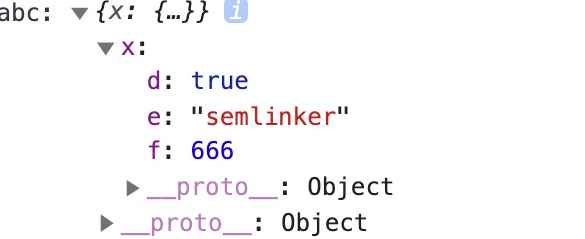

 

### 一、交叉类型

在 TypeScript 中交叉类型是将多个类型合并为一个类型。通过 `&` 运算符可以将现有的多种类型叠加到一起成为一种类型，它包含了所需的所有类型的特性。

```typescript
type typeA= { x: number; };
type typeB = typeA & { y: number; };

let point: typeB = {
  x: 1,
  y: 1
}
``` 

#### 1.1 同名基础类型属性的合并

那么现在问题来了，假设在合并多个类型的过程中，刚好出现某些类型存在相同的成员，但对应的类型又不一致，比如：

```typescript
interface X {
  c: string;
  d: string;
}

interface Y {
  c: number;
  e: string;
}

type XY = X & Y;
type YX = Y & X;

let p: XY={c: 1, d: "d", e: "e"}; ////不能将c类型“number”分配给类型“never”
```

在上面的代码中，接口 X 和接口 Y 都含有一个相同的成员 c，但它们的类型不一致。 
为什么接口 X 和接口 Y 混入后，成员 c 的类型会变成 `never` 呢？这是因为混入后成员 c 的类型为 `string & number`，即成员 c 的类型既可以是 `string` 类型又可以是 `number` 类型。很明显这种类型是不存在的，所以混入后成员 c 的类型为 `never`。

#### 1.2 同名非基础类型属性的合并

在上面示例中，刚好接口 X 和接口 Y 中内部成员 c 的类型都是基本数据类型，那么如果是非基本数据类型的话，又会是什么情形。我们来看个具体的例子：

```typescript
interface D { d: boolean; }
interface E { e: string; }
interface F { f: number; }

interface A { x: D; }
interface B { x: E; }
interface C { x: F; }

type ABC = A & B & C;

let abc: ABC = {
  x: {
    d: true,
    e: 'semlinker',
    f: 666
  }
};

console.log('abc:', abc);
```

以上代码成功运行后，控制台会输出以下结果：

 

由上图可知，在混入多个类型时，若存在相同的成员，且成员类型为非基本数据类型，那么是可以成功合并。

### 二、TypeScript 函数

#### 2.1 TypeScript 函数与 JavaScript 函数的区别

<table><thead><tr><th>TypeScript</th><th>JavaScript</th></tr></thead><tbody><tr><td>含有类型</td><td>无类型</td></tr><tr><td>箭头函数</td><td>箭头函数（ES2015）</td></tr><tr><td>函数类型</td><td>无函数类型</td></tr><tr><td>必填和可选参数</td><td>所有参数都是可选的</td></tr><tr><td>默认参数</td><td>默认参数</td></tr><tr><td>剩余参数</td><td>剩余参数</td></tr><tr><td>函数重载</td><td>无函数重载</td></tr></tbody></table>

#### 2.2 函数

##### 1. 常见语法

```typescript
myBooks.forEach(() => console.log('reading'));

myBooks.forEach(title => console.log(title));

myBooks.forEach((title, idx, arr) =>
  console.log(idx + '-' + title);
);

myBooks.forEach((title, idx, arr) => {
  console.log(idx + '-' + title);
});
let IdGenerator: (chars: string, nums: number) => string;

function createUserId(name: string, id: number): string {
  return name + id;
}

IdGenerator = createUserId;
``` 
 

#### 2.3 可选参数及默认参数

```typescript
function createUserId(name: string, id: number, age?: number): string {
  return name + id;
}


function createUserId(
  name: string = "semlinker",
  id: number,
  age?: number
): string {
  return name + id;
}
```

在声明函数时，可以通过 `?` 号来定义可选参数，比如 `age?: number` 这种形式。**在实际使用时，需要注意的是可选参数要放在普通参数的后面，不然会导致编译错误**。

#### 2.4剩余参数

```typescript
function push(array, ...items) {
  items.forEach(function (item) {
    array.push(item);
  });
}

let a = [];
push(a, 1, 2, 3);
```

#### 2.5 函数重载*

函数重载或方法重载是使用相同名称和不同参数数量或类型创建多个方法的一种能力。

```typescript
function add(a: number, b: number): number;
function add(a: string, b: string): string;
function add(a: string, b: number): string;
function add(a: number, b: string): string;
function add(a: Combinable, b: Combinable) {
  
  if (typeof a === 'string' || typeof b === 'string') {
    return a.toString() + b.toString();
  }
  return a + b;
}
```

在以上代码中，我们为 add 函数提供了多个函数类型定义，从而实现函数的重载。在 TypeScript 中除了可以重载普通函数之外，我们还可以重载类中的成员方法。

方法重载是指在同一个类中方法同名，参数不同（参数类型不同、参数个数不同或参数个数相同时参数的先后顺序不同），调用时根据实参的形式，选择与它匹配的方法执行操作的一种技术。所以类中成员方法满足重载的条件是：在同一个类中，方法名相同且参数列表不同。下面我们来举一个成员方法重载的例子：

```typescript
class Calculator {
  add(a: number, b: number): number;
  add(a: string, b: string): string;
  add(a: string, b: number): string;
  add(a: number, b: string): string;
  add(a: Combinable, b: Combinable) {
  if (typeof a === 'string' || typeof b === 'string') {
    return a.toString() + b.toString();
  }
    return a + b;
  }
}

const calculator = new Calculator();
const result = calculator.add('Semlinker', ' Kakuqo');
```

这里需要注意的是，当 TypeScript 编译器处理函数重载时，它会查找重载列表，尝试使用第一个重载定义。 如果匹配的话就使用这个。 因此，在定义重载的时候，一定要把最精确的定义放在最前面。另外在 Calculator 类中，`add(a: Combinable, b: Combinable){ }` 并不是重载列表的一部分，因此对于 add 成员方法来说，我们只定义了四个重载方法。

### 三、TypeScript 数组

#### 3.1 数组解构

```typescript
let x: number; let y: number; let z: number;
let five_array = [0,1,2,3,4];
[x,y,z] = five_array;
```

#### 3.2 数组展开运算符

```typescript
let two_array = [0, 1];
let five_array = [...two_array, 2, 3, 4];
```

#### 3.3 数组遍历

```typescript
let colors: string[] = ["red", "green", "blue"];
for (let i of colors) {
  console.log(i) // red, green, blue
}

```

### 四、TypeScript 对象

#### 4.1 对象解构

```typescript
let person = {
  name: "Semlinker",
  gender: "Male",
};

let { name, gender } = person;
```

#### 4.2 对象展开运算符

```typescript
let person = {
  name: "Semlinker",
  gender: "Male",
  address: "Xiamen",
};


let personWithAge = { ...person, age: 33 };


let { name, ...rest } = person;
```

### 五、TypeScript 接口

在面向对象语言中，接口是一个很重要的概念，它是对行为的抽象，而具体如何行动需要由类去实现。

TypeScript 中的接口是一个非常灵活的概念，除了可用于[对类的一部分行为进行抽象](https://ts.xcatliu.com/advanced/class-and-interfaces.html#%E7%B1%BB%E5%AE%9E%E7%8E%B0%E6%8E%A5%E5%8F%A3)以外，也常用于对「对象的形状（Shape）」进行描述。

#### 5.1 对象的形状

```typescript
interface Person {
  name: string;
  age: number;
}

let semlinker: Person = {
  name: "semlinker",
  age: 33,
};
```

#### 5.2 可选 | 只读属性

```typescript
interface Person {
  readonly name: string;
  age?: number;
}
```

只读属性用于限制只能在对象刚刚创建的时候修改其值。此外 TypeScript 还提供了 `ReadonlyArray<T>` 类型，它与 `Array<T>` 相似，只是把所有可变方法去掉了，因此可以确保数组创建后再也不能被修改。

```typescript
let a: number[] = [1, 2, 3, 4];
let ro: ReadonlyArray<number> = a;
ro[0] = 12; 
ro.push(5); 
ro.length = 100; 
a = ro;
```

#### 5.3 任意属性

有时候我们希望一个接口中除了包含必选和可选属性之外，还允许有其他的任意属性，这时我们可以使用 **索引签名** 的形式来满足上述要求。

```typescript
interface Person {
  name: string;
  age?: number;
  [propName: string]: any;
}

const p1 = { name: "semlinker" };
const p2 = { name: "lolo", age: 5 };
const p3 = { name: "kakuqo", sex: 1 }
```

#### 5.4 接口与类型别名的区别

#####  1.Objects/Functions

接口和类型别名都可以用来描述对象的形状或函数签名：

**接口**

```typescript
interface Point {
  x: number;
  y: number;
}

interface SetPoint {
  (x: number, y: number): void;
}
```

**类型别名**

```typescript
type Point = {
  x: number;
  y: number;
};

type SetPoint = (x: number, y: number) => void;
```

#####  2.Other Types

与接口类型不一样，类型别名可以用于一些其他类型，比如原始类型、联合类型和元组：

```typescript
type Name = string;
type PartialPointX = { x: number; };
type PartialPointY = { y: number; };
type PartialPoint = PartialPointX | PartialPointY;
type Data = [number, string];
```

##### 3.Extend*

接口和类型别名都能够被扩展，但语法有所不同。此外，接口和类型别名不是互斥的。接口可以扩展类型别名，而反过来是不行的。

**Interface extends interface**

```typescript
interface PartialPointX { x: number; }
interface Point extends PartialPointX { 
  y: number; 
}
```

**Type alias extends type alias**

```typescript
type PartialPointX = { x: number; };
type Point = PartialPointX & { y: number; };
```

**Interface extends type alias**

```typescript
type PartialPointX = { x: number; };
interface Point extends PartialPointX { y: number; }
```

**Type alias extends interface**

```typescript
interface PartialPointX { x: number; }
type Point = PartialPointX & { y: number; };
```

##### 4.Implements*

实现（implements）是面向对象中的一个重要概念。一般来讲，一个类只能继承自另一个类，有时候不同类之间可以有一些共有的特性，这时候就可以把特性提取成接口（interfaces），用 implements 关键字来实现。这个特性大大提高了面向对象的灵活性。

举例来说，门是一个类，防盗门是门的子类。如果防盗门有一个报警器的功能，我们可以简单的给防盗门添加一个报警方法。这时候如果有另一个类，车，也有报警器的功能，就可以考虑把报警器提取出来，作为一个接口，防盗门和车都去实现它：

```typescript
interface Alarm {
    alert(): void;
}

class Door {
}

class SecurityDoor extends Door implements Alarm {
    alert() {
        console.log('SecurityDoor alert');
    }
}

class Car implements Alarm {
    alert() {
        console.log('Car alert');
    }
}
//一个类实现多个接口
interface Alarm {
    alert(): void;
}

interface Light {
    lightOn(): void;
    lightOff(): void;
}

class Car implements Alarm, Light {
    alert() {
        console.log('Car alert');
    }
    lightOn() {
        console.log('Car light on');
    }
    lightOff() {
        console.log('Car light off');
    }
}
```
 

##### 5. merging

与类型别名不同，接口可以定义多次，会被自动合并为单个接口。

```
interface Point { x: number; }
interface Point { y: number; }

const point: Point = { x: 1, y: 2 };
```
