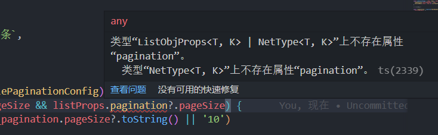
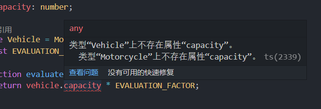

### 一、TypeScript 断言
#### 1.1 类型断言
个人理解的断言，就是断定某一个值的类型,此时TypeScript以你所给出的值类型为准，而非TypeScrip的推论
在一些复杂的类型声明 变成具体实现时往往用得到 并且避免很多类型过于复杂的情况
类型断言有两种形式：

##### 1.“尖括号” 语法

```typescript
const someValue: any = "this is a string";
let strLength: number = (<{a:number}>someValue).a;

```

##### 2.as 语法
这个用的比较多 
```typescript
let someValue = "this is a string" as string;
let strLength: number = someValue.length;
```

#### 1.2 非空断言 略详见TS符号篇
TypeScript 提供了一个特殊的语法，可以在不做任何检查的情况下，从类型中移除 null 和 undefined，这就是在任意表达式后面写上 ! ，这是一个有效的类型断言，表示它的值不可能是 null 或者 undefined： 
 
#### 1.3 确定赋值断言

在 TypeScript 2.7 版本中引入了确定赋值断言，即允许在实例属性和变量声明后面放置一个 `!` 号，从而告诉 TypeScript 该属性会被明确地赋值。为了更好地理解它的作用，我们来看个具体的例子：

```typescript
let x: number; 
console.log(2 * x); 
```

很明显会有报错，因为在赋值前使用变量，要解决该问题，我们可以使用确定赋值断言：

```typescript
let x!: number; 
console.log(2 * x);  
``` 

### 二、类型守卫

***类型保护是可执行运行时检查的一种表达式，用于确保该类型在一定的范围内。*** 换句话说，类型保护可以保证一个字符串是一个字符串，尽管它的值也可以是一个数值。
如
```typescript
//
function add(padding: number | string) {
  return padding + 10;  //运算符“+”不能应用于类型“string | number”和“number”。
}
```
类型保护与特性检测并不是完全不同，其主要思想是尝试检测属性、方法或原型，以确定如何处理值。目前主要有四种的方式来实现类型保护：
 

#### 2.1 in 关键字
js中的in 关键字  如果指定的属性在指定的对象或其原型链中，则 in 运算符返回 true。
```javascript
const car = { make: 'Honda', model: 'Accord', year: 1998 };
console.log('make' in car);  //true
delete car.make;
if ('make' in car === false) {
  car.make = 'Suzuki';
}
console.log(car.make); //Suzuki

```
typescript也是类似的
```typescript
interface Admin {
  name: string;
  privileges: string[];
}

interface Employee {
  name: string;
  startDate: Date;
}

type UnknownEmployee = Employee | Admin;

function printEmployeeInformation(emp: UnknownEmployee) {
  console.log("Name: " + emp.name);
  if ("privileges" in emp) {
    console.log("Privileges: " + emp.privileges);
  }
  if ("startDate" in emp) {
    console.log("Start Date: " + emp.startDate);
  }
}
```

#### 2.2 typeof 关键字 
// "number"， "string"， "boolean" ， "symbol" 

```typescript
function padLeft(value: string, padding: string | number) {
  if (typeof padding === "number") {
      return Array(padding + 1).join(" ") + value;
  }
  if (typeof padding === "string") {
      return padding + value;
  }
  throw new Error(`Expected string or number, got '${padding}'.`);
}
```

`typeof` 类型保护只支持两种形式：`typeof v === "typename"` 和 `typeof v !== typename`，`"typename"` 必须是 `"number"`， `"string"`， `"boolean"` 或 `"symbol"`。 但是 TypeScript 并不会阻止你与其它字符串比较，语言不会把那些表达式识别为类型保护。

####  2.3 instanceof 关键字
当联合类型中使用的是 class 而不是 interface 时，instanceof 语法就派上用场了，通过 instanceof 语法可以区分不同的 class 类型。
```typescript
class Bird {
  // 独有方法
  fly() {};
  // 共有方法
  layEggs() {};
}

class Fish {
  // 独有方法
  swim() {};
  // 共有方法
  layEggs() {};
}

function getSmallPet(): Fish | Bird {
  // ...
}

let pet = getSmallPet();
pet.layEggs(); // 正常
// 使用 in 语法进行
if (pet instanceof Bird) {
  pet.fly()
} else {
  pet.swim()
} 
```

#### 2.4 **自定义类型保护的类型谓词

```typescript
function isNumber(x: any): x is number {
  return typeof x === "number";
}

function isString(x: any): x is string {
  return typeof x === "string";
}

function isFish(pet: Fish | Bird): pet is Fish {
    return (<Fish>pet).swim !== undefined;
}
 
 if (pagination.pageSize != _pagination.pageSize && (<ListObjProps<T, K>>listProps).pagination?.pageSize) {
      localStorage.setItem(FeManagePageSize, _pagination.pageSize?.toString() || '10')
  }
``` 



### 三、联合类型和类型别名


#### 3.1 联合类型

联合类型通常与 `null` 或 `undefined` 一起使用：

```typescript
const abc = (name: string | undefined) => {
  
};
```

例如，这里 `name` 的类型是 `string | undefined` 意味着可以将 `string` 或 `undefined` 的值传递给`abc` 函数。

```typescript
abc("semlinker");
abc(undefined);
```

通过这个示例，你可以凭直觉知道类型 A 和类型 B 联合后的类型是同时接受 A 和 B 值的类型。此外，对于联合类型来说，你可能会遇到以下的用法：

```typescript
let num: 1 | 2 = 1;
type Type = 'click' | 'doubleClick' | 'mousemove';
```

 

#### 3.2 可辨识联合

TypeScript 可辨识联合（Discriminated Unions）类型，也称为代数数据类型或标签联合类型。**它包含 3 个要点：可辨识、联合类型和类型守卫。**

这种类型的本质是结合联合类型和字面量类型的一种类型保护方法。**如果一个类型是多个类型的联合类型，且多个类型含有一个公共属性，那么就可以利用这个公共属性，来创建不同的类型保护区块。**

#####  1. 可辨识

可辨识要求联合类型中的每个元素都含有一个单例类型属性，比如：

```typescript
enum CarTransmission {
  Automatic = 200,
  Manual = 300
}

interface Motorcycle {
  vType: "motorcycle"; 
  make: number; 
}

interface Car {
  vType: "car"; 
  transmission: CarTransmission
}

interface Truck {
  vType: "truck"; 
  capacity: number; 
}
```

在上述代码中，我们分别定义了 `Motorcycle`、 `Car` 和 `Truck` 三个接口，在这些接口中都包含一个 `vType` 属性，该属性被称为可辨识的属性，而其它的属性只跟特性的接口相关。

#####  2. 联合类型

基于前面定义了三个接口，我们可以创建一个 `Vehicle` 联合类型：

```typescript
type Vehicle = Motorcycle | Car | Truck;
```

现在我们就可以开始使用 `Vehicle` 联合类型，对于 `Vehicle` 类型的变量，它可以表示不同类型的车辆。

##### 3. 类型守卫

下面我们来定义一个 `evaluatePrice` 方法，该方法用于根据车辆的类型、容量和评估因子来计算价格，具体实现如下：

```typescript
const EVALUATION_FACTOR = Math.PI; 

function evaluatePrice(vehicle: Vehicle) {
  return vehicle.capacity * EVALUATION_FACTOR;
}

const myTruck: Truck = { vType: "truck", capacity: 9.5 };
evaluatePrice(myTruck);
```
 
 
原因是在 Motorcycle 接口中，并不存在 `capacity` 属性，而对于 Car 接口来说，它也不存在 `capacity` 属性。那么，现在我们应该如何解决以上问题呢？这时，我们可以使用类型守卫。下面我们来重构一下前面定义的 `evaluatePrice` 方法，重构后的代码如下：

```typescript
function evaluatePrice(vehicle: Vehicle) {
  switch(vehicle.vType) {
    case "car":
      return vehicle.transmission * EVALUATION_FACTOR;
    case "truck":
      return vehicle.capacity * EVALUATION_FACTOR;
    case "motorcycle":
      return vehicle.make * EVALUATION_FACTOR;
  }
}
```

在以上代码中，我们使用 `switch` 和 `case` 运算符来实现类型守卫，从而确保在 `evaluatePrice` 方法中，我们可以安全地访问 `vehicle` 对象中的所包含的属性，来正确的计算该车辆类型所对应的价格。

#### 3.3 类型别名

类型别名用来给一个类型起个新名字。

```typescript
type Message = string | string[];

let greet = (message: Message) => {
  
};
```